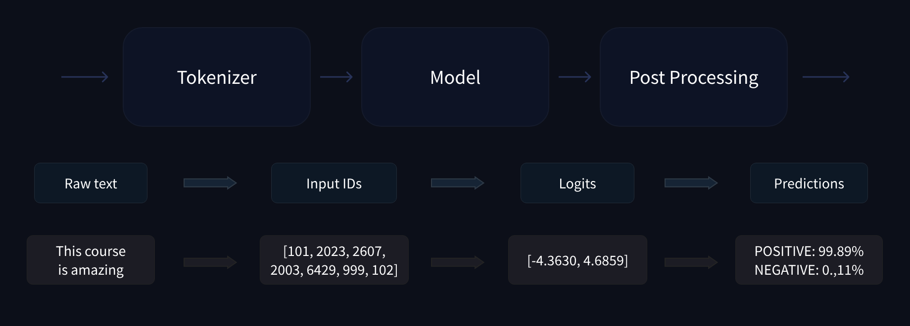

# 2. USING TRANSFORMERS

- 트랜스포머 모들엔 일반적으로 매우 크기 때문에, 모든 트랜스포머 모델을 로드하고, 학습하고, 저장하는 단일 API를 제공하는 트랜스포머 라이브러리가 탄생하게 됐다.

## 2-1. Behind the pipeline



### 🔍 Pipeline의 3단계 구조

```
전처리 (Preprocessing)
    ↓
모델 통과 (Passing inputs through the model)
    ↓
후처리 (Postprocessing)
```

### 1단계: 토크나이저를 이용한 전처리 (Preprocessing with a tokenizer)

### 왜 전처리가 필요할까?

다른 신경망들과 마찬가지로, **트랜스포머 모델은 원시 텍스트를 직접 처리할 수 없다**. 따라서 파이프라인의 첫 번째 단계는 텍스트 입력을 모델이 이해할 수 있는 숫자로 변환하는 것

### 토크나이저의 역할

- **토큰으로 분할**: 입력을 단어, 부분단어, 또는 기호(구두점 같은)로 나누기 (이를 토큰이라고 함)
- **정수 매핑**: 각 토큰을 정수로 매핑
- **추가 입력**: 모델에 유용할 수 있는 추가 입력들 추가

> 모든 전처리는 **모델이 사전 훈련될 때와 정확히 같은 방식**으로 수행되어야 한다.

### AutoTokenizer 사용하기

```python
from transformers import AutoTokenizer

# sentiment-analysis 파이프라인의 기본 체크포인트 사용
checkpoint = "distilbert-base-uncased-finetuned-sst-2-english"
tokenizer = AutoTokenizer.from_pretrained(checkpoint)
```

### 토크나이징 실행

```python
raw_inputs = [
    "I've been waiting for a HuggingFace course my whole life.",
    "I hate this so much!",
]

inputs = tokenizer(raw_inputs, padding=True, truncation=True, return_tensors="pt")
print(inputs)
```

### `return_tensors` 매개변수

반환받을 텐서의 타입을 지정

```python
inputs = tokenizer(raw_inputs, padding=True, truncation=True, return_tensors="pt")
print(inputs)
tokenizer.decode(inputs["input_ids"][0]) # 디코딩도 가능
```

- `padding=True`: 짧은 시퀀스를 길게 맞춤
- `truncation=True`: 긴 시퀀스를 자름 (BERT는 최대 512 토큰까지만 처리할 수 있어서, 더 긴 문장은 잘라냄)
- `return_tensors="pt"`: PyTorch 텐서로 반환 (TensorFlow는 "tf", 타입을 지정하지 않으면 리스트의 리스트를 반환)

### PyTorch 텐서 결과

```python
{
    'input_ids': tensor([
        [ 101, 1045, 1005, 2310, 2042, 3403, 2005, 1037, 17662, 12172, 2607, 2026, 2878, 2166, 1012, 102],
        [ 101, 1045, 5223, 2023, 2061, 2172, 999, 102, 0, 0, 0, 0, 0, 0, 0, 0]
    ]),
    'attention_mask': tensor([
        [1, 1, 1, 1, 1, 1, 1, 1, 1, 1, 1, 1, 1, 1, 1, 1],
        [1, 1, 1, 1, 1, 1, 1, 1, 0, 0, 0, 0, 0, 0, 0, 0]
    ])
}
```

- **`input_ids`**: 각 문장의 토큰들의 고유 식별자를 포함하는 두 행의 정수
- **`attention_mask`**: 이 장의 뒷부분에서 설명

### `attention_mask`가 필요한 이유

```python
texts = [
    "I love this!", # 짧은 문장 (4개 토큰)
    "I've been waiting for a HuggingFace course my whole life."  # 긴 문장 (16개 토큰)
]
```

- 컴퓨터는 효율성을 위해 한 번에 여러 문장을 처리하려고 함
- 하지만 모든 문장의 길이가 달라서 배치로 처리할 수 없음
- 패딩(Padding) - 짧은 문장을 긴 문장 길이에 맞춰 0으로 채워서 해결하자

```python
# 패딩 전
sentence1: [101, 1045, 2293, 2023, 999, 102]              # 길이 6
sentence2: [101, 1045, 1005, 2310, ..., 2166, 1012, 102]  # 길이 16

# 패딩 후
sentence1: [101, 1045, 2293, 2023, 999, 102, 0, 0, 0, 0, 0, 0, 0, 0, 0, 0]  # 길이 16
sentence2: [101, 1045, 1005, 2310, ..., 2166, 1012, 102, 0, 0, 0, 0, 0, 0]  # 길이 16

```

- 모델이 패딩 토큰(0)을 실제 단어로 착각할 수 있기 때문에,

- `attention_mask`를 통해 실제 단어(활용할 토큰)는 1로, 패딩 토큰은 0으로 설정해 패딩 토큰은 무시한다.

---

### 2단계: 모델 통과 (Going through the model)

### 사전 훈련된 모델 다운로드

토크나이저와 같은 방식으로 사전 훈련된 모델을 다운로드할 수 있다. Transformers는 `from_pretrained()` 메서드를 가진 `AutoModel` 클래스를 제공한다.

```python
from transformers import AutoModel

checkpoint = "distilbert-base-uncased-finetuned-sst-2-english"
model = AutoModel.from_pretrained(checkpoint)

# 토큰화된 숫자들을 넣으면
outputs = base_model(**inputs)
print(outputs.last_hidden_state.shape)
# torch.Size([2, 16, 768])
```

### AutoModel & AutoModelForSequenceClassification

AutoModel만으로는 "긍정/부정"을 판단할 수 없기 때문에 AutoModelForSequenceClassification 사용

```python
# AutoModel (의미만 파악, 결론 없음)
base_model = AutoModel.from_pretrained(checkpoint)
outputs = base_model(**inputs)
print(outputs.shape)  # [2, 8, 768] - 각 토큰마다 768개 의미벡터

# AutoModelForSequenceClassification (의미 파악 + 결론)
classifier_model = AutoModelForSequenceClassification.from_pretrained(checkpoint)
outputs = classifier_model(**inputs)
print(outputs.logits.shape)  # [2, 2] - 문장별로 [부정점수, 긍정점수]
```

```
토큰들 → 기본 블록 → 768차원 벡터들 → 분류 블록 → 2개 점수
[101,1045...] → [0.1,-0.3...] → 선형변환 → [-1.56, 1.61]
```

- **`AutoModel`**: 단어 의미만 파악 (768차원 벡터들)
- **`AutoModelForSequenceClassification`**: 의미 파악 + 감정 판단 (2개 점수)
- Pipeline은 두 번째 걸 사용해서 바로 답을 준다

### 모델 입력 차원 문제

```python
# 잘못된 방법 - 1차원 텐서
input_ids = torch.tensor(ids)
model(input_ids)  # 에러 발생!

# 올바른 방법 - 2차원 텐서 (배치 형태)
input_ids = torch.tensor([ids])  # 배치 차원 추가
model(input_ids)  # 정상 작동
```

모델은 기본적으로 여러 문장(배치)을 입력받도록 설계되어 있어서, 단일 문장이라도 배치 차원을 추가해야 함

---

### 3단계: 출력 후처리

모델의 출력으로 얻는 값들은 그 자체로는 의미가 있지 않다.

```python
print(outputs.logits)
# tensor([[-1.5607,  1.6123],
#         [ 4.1692, -3.3464]], grad_fn=<AddmmBackward>)
```

**이것들은 확률이 아니라 로짓이다.** 즉 모델의 마지막 레이어에서 출력된 원시, 정규화되지 않은 점수다.

### 확률로 변환: SoftMax

로짓을 확률로 변환하려면 **[SoftMax](https://en.wikipedia.org/wiki/Softmax_function) 레이어**를 거쳐야 한다.

> Softmax: 지수함수로 모든 값을 양수로 만들고, 전체 합으로 나눠서 합을 1로 만듦

```python
import torch

predictions = torch.nn.functional.softmax(outputs.logits, dim=-1)
print(predictions)
# tensor([[4.0195e-02, 9.5980e-01],
#         [9.9946e-01, 5.4418e-04]], grad_fn=<SoftmaxBackward>)
```

### 레이블 매핑

- 첫 번째 문장: `[0.0402, 0.9598]`
- 두 번째 문장: `[0.9995, 0.0005]`

각 위치에 해당하는 레이블을 얻으려면 모델 설정의 `id2label` 속성을 확인할 수 있다:

```python
model.config.id2label
# {0: 'NEGATIVE', 1: 'POSITIVE'}
```

## 2-2. Models

### 1. 모델 로드하기

```python
from transformers import AutoModel # 자동 로드
model = AutoModel.from_pretrained("bert-base-cased")

from transformers import BertModel # 모델 타입 로드
model = BertModel.from_pretrained("bert-base-cased")
```

- `AutoModel`은 체크포인트 이름을 보고 자동으로 적절한 모델을 선택해주는 편리한 클래스
- "bert-base-cased"는 BERT 모델의 기본 구조(12층, 768 은닉크기, 12개 어텐션 헤드)를 의미
- 특정 모델을 직접 사용하고 싶으면 `모델 타입으로 로드(Bert.from_preterained)`

### 2. 모델 저장하고 불러오기

**모델 저장하고 불러오기**

```python
# 모델 저장하기
model.save_pretrained("src")

# 모델 불러오기
model = AutoModel.from_pretrained("src")
```

**Hugging Face Hub에 공유하기**

```python
# 로그인 후
from huggingface_hub import notebook_login notebook_login()
model.push_to_hub("내-멋진-모델~")

# 다른 사람이 사용할 때
model = AutoModel.from_pretrained("사용자명/내-멋진-모델~")
```

---

## 2-3. Tokenizers

### 토크나이제이션 알고리즘 종류

**1. `단어 기반 토크나이제이션 (Word-based)`**

```python
tokenized_text = "Jim Henson was a puppeteer".split()
print(tokenized_text)
# ['Jim', 'Henson', 'was', 'a', 'puppeteer']
```

**장점:**

- 설정이 간단하고 사용하기 쉬움
- 직관적임

**단점:**

- 어휘량이 매우 큼 (영어만 50만 단어 이상)
- "dog"와 "dogs"를 완전히 다른 단어로 인식
- 어휘에 없는 단어는 [UNK] 토큰으로 처리

**2. `문자 기반 토크나이제이션 (Character-based)`**

```python
# "Hello" → ['H', 'e', 'l', 'l', 'o']
```

**장점:**

- 어휘량이 작음
- [UNK] 토큰이 거의 없음

**단점:**

- 개별 문자는 의미가 제한적
- 시퀀스가 매우 길어짐 (단어 하나가 10개 이상의 토큰으로)

**3. `서브워드 토크나이제이션 (Subword)` ⭐ 최적!**

가장 좋은 방법! 자주 사용되는 단어는 분할하지 않고, 드문 단어는 의미 있는 서브워드로 분해

```python
# "annoyingly" → ["annoying", "ly"]
# "tokenization" → ["token", "ization"]
```

**주요 알고리즘:**

- `Byte-level BPE`: GPT-2에서 사용
- `WordPiece`: BERT에서 사용
- `SentencePiece/Unigram`: 다국어 모델에서 사용

### 토크나이저 저장과 로딩

```python
from transformers import AutoTokenizer

# 토크나이저 로딩
tokenizer = AutoTokenizer.from_pretrained("bert-base-cased")

# 토크나이저 저장
tokenizer.save_pretrained("my_tokenizer")

# 저장된 토크나이저 로딩
tokenizer = AutoTokenizer.from_pretrained("my_tokenizer")
```

### 인코딩 과정 상세 분석

**1단계: 토크나이제이션**

```python
from transformers import AutoTokenizer

tokenizer = AutoTokenizer.from_pretrained("bert-base-cased")
sequence = "Using a Transformer network is simple"

tokens = tokenizer.tokenize(sequence)
print(tokens)
# ['Using', 'a', 'transform', '##er', 'network', 'is', 'simple']
```

**2단계: 토큰을 ID로 변환**

```python
ids = tokenizer.convert_tokens_to_ids(tokens)
print(ids)
# [7993, 170, 11303, 1200, 2443, 1110, 3014]
```

**디코딩: ID를 다시 텍스트로**

```python
decoded_string = tokenizer.decode([7993, 170, 11303, 1200, 2443, 1110, 3014])
print(decoded_string)
# 'Using a Transformer network is simple'
```

### 특수 토큰 자동 추가

```python
sequence = "I've been waiting for a HuggingFace course my whole life."

# 직접 토크나이징
tokens = tokenizer.tokenize(sequence)
ids = tokenizer.convert_tokens_to_ids(tokens)
print(ids)
# [1045, 1005, 2310, 2042, 3403, 2005, 1037, 17662, 12172, 2607, 2026, 2878, 2166, 1012]

# 토크나이저로 한번에 처리
model_inputs = tokenizer(sequence)
print(model_inputs["input_ids"])
# [101, 1045, 1005, 2310, 2042, 3403, 2005, 1037, 17662, 12172, 2607, 2026, 2878, 2166, 1012, 102]

# 디코딩해보면
print(tokenizer.decode(model_inputs["input_ids"]))
# "[CLS] i've been waiting for a huggingface course my whole life. [SEP]"
```

**자동으로 추가되는 특수 토큰:**

- `[CLS]`: 문장의 시작 (ID: 101)
- `[SEP]`: 문장의 끝 (ID: 102)

---

## 2-4. 여러 시퀀스 처리하기

### 배치 처리의 필요성

```python
# 단일 시퀀스는 에러!
input_ids = torch.tensor(ids)
model(input_ids)  # IndexError 발생!

# 배치 형태로 만들어야 함 - 단일이어도 2차원으로 생성할 것
input_ids = torch.tensor([ids])  # 2차원으로 변경
model(input_ids)  # 정상 작동
```

### 패딩이 필요한 이유

```python
# 길이가 다른 문장들
batched_ids = [
    [200, 200, 200],      # 길이 3
    [200, 200]            # 길이 2
]
# 이걸 텐서로 만들 수 없음 (직사각형이 아니므로)

# 패딩으로 해결
padding_id = 100
batched_ids = [
    [200, 200, 200],
    [200, 200, padding_id],  # 패딩 추가
]
```

### Attention Mask의 중요성

패딩 토큰을 무시하도록 어텐션 마스크 사용

```python
batched_ids = [
    [200, 200, 200],
    [200, 200, tokenizer.pad_token_id],
]

attention_mask = [
    [1, 1, 1],    # 모든 토큰 주의
    [1, 1, 0],    # 마지막 토큰(패딩) 무시
]

outputs = model(
    torch.tensor(batched_ids),
    attention_mask=torch.tensor(attention_mask)
)
```

### 시퀀스 길이 제한

대부분의 Transformer 모델은 **512-1024 토큰** 제한이 있음:

```python
# 긴 시퀀스 처리 방법
sequences = ["매우 긴 텍스트..."]

# 방법 1: 잘라내기
model_inputs = tokenizer(sequences, truncation=True)

# 방법 2: 긴 시퀀스 전용 모델 사용
# - Longformer: 4096 토큰까지
# - LED: 16384 토큰까지
```

---

## 2-5. Putting it all together

토크나이저의 강력한 통합 API: 수동으로 하던 모든 작업을 토크나이저가 한번에 처리

```python
from transformers import AutoTokenizer

checkpoint = "distilbert-base-uncased-finetuned-sst-2-english"
tokenizer = AutoTokenizer.from_pretrained(checkpoint)

# 단일 시퀀스
sequence = "I've been waiting for a HuggingFace course my whole life."
model_inputs = tokenizer(sequence)

# 여러 시퀀스
sequences = [
    "I've been waiting for a HuggingFace course my whole life.",
    "So have I!"
]
model_inputs = tokenizer(sequences)
```

### 다양한 패딩 옵션

```python
# 가장 긴 시퀀스에 맞춰 패딩
model_inputs = tokenizer(sequences, padding="longest")

# 모델 최대 길이에 맞춰 패딩 (512토큰)
model_inputs = tokenizer(sequences, padding="max_length")

# 지정된 길이에 맞춰 패딩
model_inputs = tokenizer(sequences, padding="max_length", max_length=8)
```

### 잘라내기 옵션

```python
# 모델 최대 길이로 잘라내기
model_inputs = tokenizer(sequences, truncation=True)

# 지정된 길이로 잘라내기
model_inputs = tokenizer(sequences, max_length=8, truncation=True)
```

### 프레임워크별 텐서 반환

```python
sequences = ["I've been waiting for a HuggingFace course my whole life.", "So have I!"]

# PyTorch 텐서
model_inputs = tokenizer(sequences, padding=True, return_tensors="pt")

# NumPy 배열
model_inputs = tokenizer(sequences, padding=True, return_tensors="np")

# TensorFlow 텐서
model_inputs = tokenizer(sequences, padding=True, return_tensors="tf")
```

### 완전한 파이프라인

```python
import torch
from transformers import AutoTokenizer, AutoModelForSequenceClassification

checkpoint = "distilbert-base-uncased-finetuned-sst-2-english"
tokenizer = AutoTokenizer.from_pretrained(checkpoint)
model = AutoModelForSequenceClassification.from_pretrained(checkpoint)

sequences = [
    "I've been waiting for a HuggingFace course my whole life.",
    "So have I!"
]

# 모든 전처리를 한번에
tokens = tokenizer(
    sequences,
    padding=True,
    truncation=True,
    return_tensors="pt"
)

# 모델에 바로 입력
output = model(**tokens)
print(output.logits)
```
